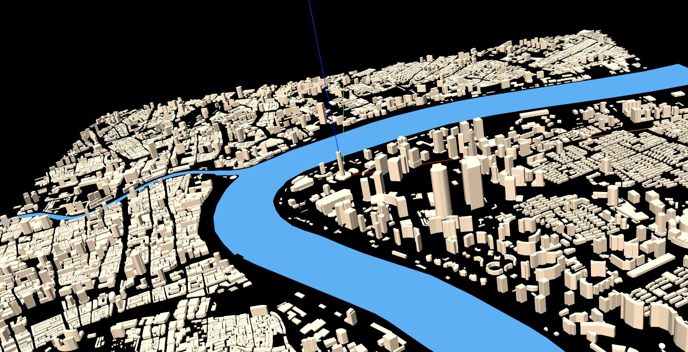

<Boxx/>

<!-- more -->

[[toc]]
采用ExtrudeGeometry把平面建筑拉伸高度
## ExtrudeGeometry
```javascript
var model = new THREE.Group(); //声明一个组对象，用来添加加载成功的三维场景


var shape1 = new THREE.Shape([
  // 一个多边形轮廓的五个顶点坐标
  new THREE.Vector2(0, 0),
  new THREE.Vector2(60, 0),
  new THREE.Vector2(60, 80),
  new THREE.Vector2(40, 120),
  new THREE.Vector2(-20, 80),
]);

var shape2 = new THREE.Shape([
  new THREE.Vector2(100, 0),
  new THREE.Vector2(160, 0),
  new THREE.Vector2(160, 80),
  new THREE.Vector2(140, 120),
]);

//ShapeGeometry：填充多边形
var geometry = new THREE.ExtrudeGeometry([shape1, shape2], {
  depth: 50, //拉伸高度
  bevelEnabled: false, //无倒角
});


var material = new THREE.MeshLambertMaterial({
  color: 0x00ffff,
  side: THREE.DoubleSide,
  // wireframe:true,//查看生成的三角形
}); //材质对象
var mesh = new THREE.Mesh(geometry, material); //网格模型对象

model.add(mesh); //网格模型添加到model中
```
## 拉伸建筑
建筑数据拉伸 ,河流只填充
```javascript
// MeshBasicMaterial:不受光照影响
// MeshLambertMaterial：几何体表面和光线角度不同，明暗不同
var material = new THREE.MeshLambertMaterial({
  color: 0x009999,
}); //材质对象
// pointsArrs：多个轮廓，一个轮廓对应pointsArrs的一个元素
function ExtrudeMesh(pointsArrs, height) {
  var shapeArr = []; //轮廓形状Shape集合
  pointsArrs.forEach(pointsArr => {
    var vector2Arr = [];
    // 转化为Vector2构成的顶点数组
    pointsArr[0].forEach(elem => {
      var xy = lon2xy(elem[0],elem[1]);//经纬度转墨卡托坐标
      vector2Arr.push(new THREE.Vector2(xy.x, xy.y));
    });
    var shape = new THREE.Shape(vector2Arr);
    shapeArr.push(shape);
  });

  var geometry = new THREE.ExtrudeGeometry( //拉伸造型
    shapeArr, //多个多边形二维轮廓
    //拉伸参数
    {
      depth: height, //拉伸高度
      bevelEnabled: false, //无倒角
    }
  );
  var mesh = new THREE.Mesh(geometry, material); //网格模型对象
  return mesh;
}
```

## 模型的导出(下载)
```javascript
// 从项目中指定路径导入 GLTFExporter
import { GLTFExporter } from '../../../../three.js-r133/examples/jsm/exporters/GLTFExporter.js';

// 定义一个名为 exportGLTF 的函数，接受一个名为 'input' 的参数
function exportGLTF(input) {
    // 创建 GLTFExporter 的实例
    var gltfExporter = new GLTFExporter();

    // 定义导出选项
    var options = {
        trs: false,                  // 不包含变换（位置、旋转、缩放）
        onlyVisible: true,           // 仅导出可见的对象
        truncateDrawRange: true,     // 截断几何体的绘制范围
        binary: true,                // 以二进制格式（.glb）导出，而不是 JSON 格式（.gltf）
        forceIndices: false,         // 强制包含索引（不跳过）
        forcePowerOfTwoTextures: false // 不强制使用二次幂的纹理尺寸
    };

    // 使用 GLTFExporter 解析输入场景和选项
    gltfExporter.parse(input, function (result) {
        // 检查结果是否为 ArrayBuffer（二进制数据）
        if (result instanceof ArrayBuffer) {
            // 将二进制结果保存为 Blob，并触发下载，文件名为 'scene.glb'
            save(new Blob([result], { type: 'application/octet-stream' }), 'scene.glb');
        } else {
            // 将结果转换为格式化的 JSON 字符串
            var output = JSON.stringify(result, null, 2);
            // 将 JSON 结果保存为 Blob，并触发下载，文件名为 'scene.gltf'
            save(new Blob([output], { type: 'text/plain' }), 'scene.gltf');
        }
    }, options);
}

// 创建一个不可见的链接元素，用于触发下载
var link = document.createElement('a');
//link.style.display = 'none';

// 定义保存函数，设置链接的 href 和 download 属性，并触发点击事件
function save(blob, filename) {
    link.href = URL.createObjectURL(blob);
    link.download = filename;
    link.click();
}

// 导出 exportGLTF 函数，供代码的其他部分使用
export {
    exportGLTF
};
```
