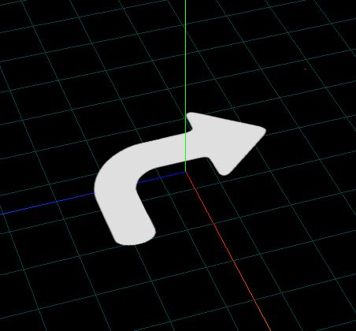

<Boxx/>

<!-- more -->

[[toc]]

U方向为横坐标 V方向为纵坐标
## 1.创建纹理贴图

```javascript
const texLoader = new THREE.TextureLoader();
// .load()方法加载图像，返回一个纹理对象Texture
const texture = texLoader.load('./earth.jpg');
const material = new THREE.MeshLambertMaterial({
    // color: 0x00ffff,
    // 设置纹理贴图：Texture对象作为材质map属性的属性值
    map: texture,//map表示材质的颜色贴图属性
});
```
## 2.自定义顶点UV坐标
你想取图片的那个区域?你自己来决定.自己去定义几何体的uv
```javascript
import * as THREE from 'three';

const geometry = new THREE.BufferGeometry(); //创建一个几何体对象
//类型数组创建顶点数据
const vertices = new Float32Array([
    0, 0, 0, //顶点1坐标
    160, 0, 0, //顶点2坐标
    160, 80, 0, //顶点3坐标
    0, 80, 0, //顶点4坐标
]);
// 创建属性缓冲区对象
const attribue = new THREE.BufferAttribute(vertices, 3); //3个为一组，表示一个顶点的xyz坐标
// 设置几何体attributes属性的位置属性
geometry.attributes.position = attribue;

// Uint16Array类型数组创建顶点索引数据
const indexes = new Uint16Array([
    0, 1, 2, 0, 2, 3,
])
// 索引数据赋值给几何体的index属性
geometry.index = new THREE.BufferAttribute(indexes, 1); //1个为一组

/**纹理坐标0~1之间随意定义*/
const uvs = new Float32Array([
    0, 0, //图片左下角
    1, 0, //图片右下角
    1, 1, //图片右上角
    0, 1, //图片左上角
]);
// 获取纹理贴图左下角四分之一部分的像素值
// const uvs = new Float32Array([
//     0, 0, 
//     0.5, 0, 
//     0.5, 0.5, 
//     0, 0.5, 
// ]);
// 设置几何体attributes属性的位置normal属性
geometry.attributes.uv = new THREE.BufferAttribute(uvs, 2); //2个为一组,表示一个顶点的纹理坐标


//纹理贴图加载器TextureLoader
const texLoader = new THREE.TextureLoader();
const texture = texLoader.load('./earth.jpg');
const material = new THREE.MeshBasicMaterial({
    map: texture, //map表示材质的颜色贴图属性
});
const mesh = new THREE.Mesh(geometry, material);

export default mesh;
```
## 阵列纹理

```javascript
const texLoader = new THREE.TextureLoader();
// .load()方法加载图像，返回一个纹理对象Texture
const texture = texLoader.load('./瓷砖.jpg');

// 设置阵列
texture.wrapS = THREE.RepeatWrapping;
texture.wrapT = THREE.RepeatWrapping;
// uv两个方向纹理重复数量
texture.repeat.set(30,30);//注意选择合适的阵列数量
```
## 5.矩形Mesh+背景透明png贴图(场景标注)

```javascript
const geometry = new THREE.PlaneGeometry(50, 50);
//纹理贴图加载器TextureLoader
const texLoader = new THREE.TextureLoader();
// .load()方法加载图像，返回一个纹理对象Texture
// const texture = texLoader.load('./指南针.png');
const texture = texLoader.load('./转弯.png');

const material = new THREE.MeshLambertMaterial({
    map: texture,//map表示材质的颜色贴图属性
    transparent:true,//开启透明，这样png贴图的透明部分不显示
});


const mesh = new THREE.Mesh(geometry, material);

mesh.rotateX(-Math.PI/2);
mesh.position.y = 1;

```


## UV动画

```javascript
const texLoader = new THREE.TextureLoader();
// .load()方法加载图像，返回一个纹理对象Texture
const texture = texLoader.load('./纹理2.jpg');

const material = new THREE.MeshLambertMaterial({
    map: texture,//map表示材质的颜色贴图属性
});
const mesh = new THREE.Mesh(geometry, material);
mesh.rotateX(-Math.PI/2);

// 设置.wrapS也就是U方向，纹理映射模式(包裹模式)
texture.wrapS = THREE.RepeatWrapping;//对应offste.x偏移
function render() {
    texture.offset.x +=0.003;//设置纹理动画
    renderer.render(scene, camera);
    requestAnimationFrame(render);
}
render();
```
## 阵列动画
只需要很小的图片就可以动画了
```javascript
// 一个矩形平面几何体用来表示传送带
const geometry = new THREE.PlaneGeometry(200, 20);
//纹理贴图加载器TextureLoader
const texLoader = new THREE.TextureLoader();
// .load()方法加载图像，返回一个纹理对象Texture
const texture = texLoader.load('./纹理3.jpg');

const material = new THREE.MeshLambertMaterial({
    map: texture,//map表示材质的颜色贴图属性
});
const mesh = new THREE.Mesh(geometry, material);
mesh.rotateX(-Math.PI/2);

// 设置阵列
texture.wrapS = THREE.RepeatWrapping;
// uv两个方向纹理重复数量
texture.repeat.x=50;//注意选择合适的阵列数量
function render() {
    texture.offset.x +=0.1;//设置纹理动画
    renderer.render(scene, camera);
    requestAnimationFrame(render);
}
render();

```
