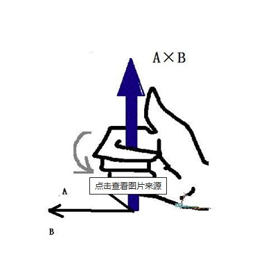

<Boxx/>

<!-- more -->

[[toc]]

## 向量点乘
我主要用向量的点乘来计算两个向量之间的夹角,例如我可以通过模型方向和目标方向的夹角来判断物体在哪里?
向量归一化之后的点乘就直接得到了cos值了,直接反余弦得到弧度值.
```javascript
const a = new THREE.Vector3(10, 10, 0);
const b = new THREE.Vector3(20, 0, 0);

// dot几何含义：向量a长度 * 向量b长度 * cos(ab夹角)
const dot = a.dot(b);//向量a与向量b点乘，返回结果是一个数字
console.log('点乘结果',dot);
// a、b向量归一化后点乘
const cos =  a.normalize().dot(b.normalize());
console.log('向量夹角余弦值',cos);
const rad = Math.acos(cos);//反余弦计算向量夹角弧度
console.log('向量夹角弧度',rad);
// 弧度转角度
const angle = THREE.MathUtils.radToDeg(rad);
console.log('向量夹角角度值',angle);
```
## 点乘判断物体在人前或人后
```javascript
// 已知条件
person.position.set(0, 0, 2);//人位置
mesh.position.set(2, 0, -3);//物体位置
// mesh.position.set(2, 0, 5);//调整物体挪到人后面测试代码判断是否正确
// a向量：人的正前方沿着z轴负半轴
const a = new THREE.Vector3(0, 0, -1);

// 物体坐标减去人坐标，创建一个人指向物体的向量
const b = mesh.position.clone().sub(person.position);

const dot = a.dot(b);//向量a和b点乘

if (dot > 0) {// 物体在人前面，向量a和b夹角0~90度，夹角余弦值大于0，a和b点乘`.dot()`大于0。
    console.log('物体在人前面');
} else if (dot < 0) {// 物体在人后面，向量a和b夹角0~180度，夹角余弦值小于0，a和b点乘`.dot()`小于0
    console.log('物体在人后面');
}
```
## 点乘判断是否在扇形内
```javascript
// 已知条件
person.position.set(0, 0, 2);//人位置
mesh.position.set(2, 0, -3);//物体位置

// a向量：人的正前方沿着z轴负半轴
const a = new THREE.Vector3(0, 0, -1);

// 扇形范围
const R = 20;//人前方扇形半径
const angle = 60;//人前方扇形角度


// 物体坐标减去人坐标，创建一个人指向物体的向量
const b = mesh.position.clone().sub(person.position);
const L = b.length();//物体与人的距离


b.normalize();//归一化
const cos = a.dot(b);//向量a和b夹角余弦值
const rad = THREE.MathUtils.degToRad(angle);// 角度转弧度
const rangeCos = Math.cos(rad / 2);// 扇形角度一半的余弦值

if (L < R) {//物体与人的距离在半径R以内
    if (cos > rangeCos) {//物体在人前方60度扇形里面
        console.log('人在半径为R，角度为angle的扇形区域内');
    }else{
        console.log('不在扇形区域内');
    }
}else{
    console.log('不在扇形区域内');
}
```
## 向量叉乘

```javascript
const a = new THREE.Vector3(50, 0, 0);
const b = new THREE.Vector3(30, 0, 30);
// 箭头可视化向量a、向量b
const O = new THREE.Vector3(0, 0, 0);//给箭头设置一个起点
const arrowA = new THREE.ArrowHelper(a.clone().normalize(), O, a.length(),0xff0000);
group.add(arrowA);
const arrowB = new THREE.ArrowHelper(b.clone().normalize(), O, b.length(),0x00ff00);
group.add(arrowB);


const c = new THREE.Vector3();// 创建一个向量c保存叉乘结果
c.crossVectors(a,b);//向量a叉乘b

// 可视化向量a和b叉乘结果：向量c
const arrowC = new THREE.ArrowHelper(c.clone().normalize(), O, c.length()/30,0x0000ff);
group.add(arrowC);

// 向量c方向与向量a、b构成的平面垂直
// 向量c的长度.length()几何含义，是a长度*b长度*sin(ab夹角θ)
```
## 叉乘判断人左右
```javascript
// 已知条件
person.position.set(0, 0, 2);//人位置
// a向量：人的正前方沿着z轴负半轴
const a = new THREE.Vector3(0, 0, -5);
// 箭头可视化向量a
const arrowA = new THREE.ArrowHelper(a.clone().normalize(), person.position, a.length(),0xff0000);
model.add(arrowA);

mesh.position.set(2, 0, -3);//物体位置在人右边 向量c朝下    
// mesh.position.set(-2, 0, -3);//物体位置在人左边 向量c朝上

// 物体坐标减去人坐标，创建一个人指向物体的向量
const b = mesh.position.clone().sub(person.position);
const arrowB = new THREE.ArrowHelper(b.clone().normalize(), person.position, b.length(),0x00ff00);
model.add(arrowB);


const c = a.clone().cross(b);
c.normalize()

// 可视化向量c方向
const arrowC = new THREE.ArrowHelper(c, person.position, 2.5 ,0x0000ff);
model.add(arrowC);

// 根据向量c方向，判断物体在人的左侧还是右侧。
if(c.y < 0){
    console.log('物体在人右侧');
}else if(c.y > 0){
    console.log('物体在人左侧');
}
```
## 叉乘计算三角形面积
```javascript
// 已知三角形三个顶点的坐标，计算三角形面积
const p1 = new THREE.Vector3(0, 0, 0);
const p2 = new THREE.Vector3(10, 0, 0);
const p3 = new THREE.Vector3(0, 10, 0);


// 三角形两条边构建两个向量
const a = p2.clone().sub(p1);
const b = p3.clone().sub(p1);
// 两个向量叉乘结果c的几何含义：a.length()*b.length()*sin(θ)
const c = a.clone().cross(b);

// 三角形面积计算
const S = 0.5*c.length();

console.log('S',S);
```
