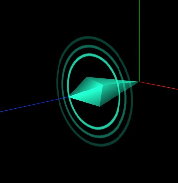
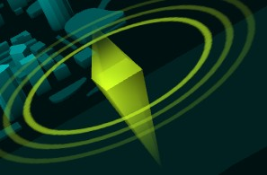

<Boxx/>

<!-- more -->

[[toc]]

## 地面波动光圈
```javascript
var geometry = new THREE.PlaneGeometry(30, 30); //默认在XOY平面上
var textureLoader = new THREE.TextureLoader(); // TextureLoader创建一个纹理加载器对象
var material = new THREE.MeshBasicMaterial({
  color: 0x22ffcc, //设置光圈颜色
  map: textureLoader.load('./scene/标注光圈.png'),
  transparent: true, //使用背景透明的png贴图，注意开启透明计算      
  // side: THREE.DoubleSide, //双面可见
});
var mesh = new THREE.Mesh(geometry, material); //网格模型对象Mesh
model.add(mesh); //网格模型添加到model中

mesh.rotateX(-Math.PI/2);

// 波动动画
var S= 20;//波动范围倍数设置
var _s = 1.0;
function waveAnimation() {
  _s += 0.4;
  mesh.scale.set(_s, _s,  _s);
  if (_s <= S*0.2) {
      material.opacity = (_s - 1) /(S*0.2-1);//保证透明度在0~1之间变化
  } else if (_s > S*0.2 && _s <= S) {
      material.opacity = 1 - (_s - S*0.2) /(S - S*0.2);//保证透明度在0~1之间变化
  } else {
      _s = 1.0;
  }
  requestAnimationFrame(waveAnimation);
}
waveAnimation();
```

## 棱锥
```javascript
import {
    createWaveMesh
  } from './WaveMesh.js';
// size:控制整体大小
function createConeMesh(size) {
    var height = size * 4; //棱锥高度
    // 圆锥体几何体API(ConeGeometry)圆周方向四等分实现四棱锥效果
    var geometry = new THREE.ConeGeometry(size, height, 4);
    // 可以根据需要旋转到特定角度
    // geometry.rotateX(Math.PI);
    geometry.rotateX(-Math.PI / 2);
    geometry.translate(0, 0, height / 2);
    // MeshBasicMaterial MeshLambertMaterial
    var material = new THREE.MeshLambertMaterial({
        // color: 0xffcc00,
        color: 0x22ffcc,
    });
    var mesh = new THREE.Mesh(geometry, material);

    // 棱锥上在叠加一个棱锥
    var mesh2 = mesh.clone();
    mesh2.scale.z = 0.5;
    mesh2.position.z = height * (1 + mesh2.scale.z);
    mesh2.rotateX(Math.PI);
    mesh.add(mesh2);


    // 棱锥旋转动画
    function animation() {
        mesh.rotateZ(0.05);
        requestAnimationFrame(animation);
    }
    animation();

    var WaveMesh =  createWaveMesh(size);
    WaveMesh.position.z = height;
    // createWaveMesh(size);
    mesh.add(WaveMesh);

    return mesh;
}
export {
    createConeMesh
};
```
## 透明棱锥(贴图法)
```javascript
// 引入three.js
import * as THREE from '../../../../three.js-r133/build/three.module.js';
import {
    createWaveMesh
  } from './WaveMesh.js';
// size:控制整体大小
function createConeMesh(size) {
    var height = size * 4; //棱锥高度
    // 圆锥体几何体API(ConeGeometry)圆周方向四等分实现四棱锥效果
    var geometry = new THREE.ConeGeometry(size, height, 4,1,true);
    // 可以根据需要旋转到特定角度
    // geometry.rotateX(Math.PI);
    geometry.rotateX(-Math.PI / 2);
    geometry.translate(0, 0, height / 2);
    var material = new THREE.MeshLambertMaterial({
        map: new THREE.TextureLoader().load('./scene/渐变3.png'),
        // color: 0x22ffcc,
        color: 0xccff22,
        transparent: true, //需要开启透明度计算，否则着色器透明度设置无效
        // opacity: 0.5,//整体改变透明度
        side:THREE.DoubleSide,
        depthTest:false,
    });
    var mesh = new THREE.Mesh(geometry, material);

    // 棱锥上在叠加一个棱锥
    var mesh2 = mesh.clone();
    mesh2.scale.z = 0.5;
    mesh2.position.z = height * (1 + mesh2.scale.z);
    mesh2.rotateX(Math.PI);
    mesh.add(mesh2);


    // 棱锥旋转动画
    function animation() {
        mesh.rotateZ(0.05);
        requestAnimationFrame(animation);
    }
    animation();

    var WaveMesh =  createWaveMesh(size);
    WaveMesh.position.z = height;
    mesh.add(WaveMesh);

    return mesh;
}
export {
    createConeMesh
};
```

