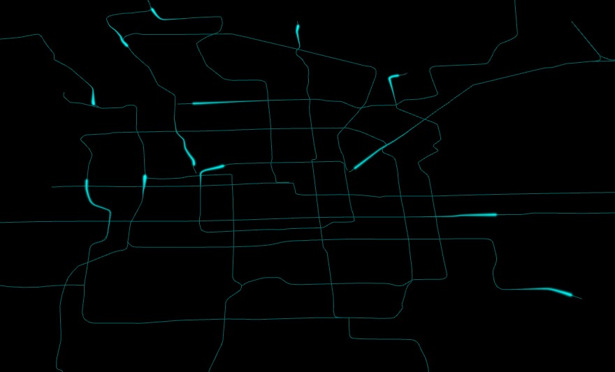

<Boxx/>

<!-- more -->

[[toc]]

## 飞线
```javascript
// 引入Three.js
import * as THREE from '../../../../three.js-r133/build/three.module.js';


var model = new THREE.Group(); //声明一个组对象
/**
 * 创建线条模型
 */
var geometry = new THREE.BufferGeometry(); //创建一个缓冲类型几何体
// 三维样条曲线
var curve = new THREE.CatmullRomCurve3([
  new THREE.Vector3(100, 0, -100),
  new THREE.Vector3(0, 80, 0),
  new THREE.Vector3(-100, 0, 100),
]);
//曲线上等间距返回多个顶点坐标
var points = curve.getSpacedPoints(100); //分段数100，返回101个顶点
// setFromPoints方法从points中提取数据赋值给attributes.position
geometry.setFromPoints(points);
var material = new THREE.LineBasicMaterial({
  color: 0x006666, //轨迹颜色
});
//线条模型对象
var line = new THREE.Line(geometry, material);
model.add(line);


var index = 20; //取点索引位置
var num = 15; //从曲线上获取点数量
var points2 = points.slice(index, index + num); //从曲线上获取一段
var curve = new THREE.CatmullRomCurve3(points2);
console.log(points2)
var newPoints2 = curve.getSpacedPoints(100); //获取更多的点数
var geometry2 = new THREE.BufferGeometry();
geometry2.setFromPoints(newPoints2);
// 每个顶点对应一个百分比数据attributes.percent 用于控制点的渲染大小
var percentArr = []; //attributes.percent的数据
for (var i = 0; i < newPoints2.length; i++) {
  percentArr.push(i / newPoints2.length);
}
var percentAttribue = new THREE.BufferAttribute(new Float32Array(percentArr), 1);
geometry2.attributes.percent = percentAttribue;
// 批量计算所有顶点颜色数据
var colorArr = [];
for (var i = 0; i < newPoints2.length; i++) {
  var color1 = new THREE.Color(0x006666); //轨迹线颜色 青色
  var color2 = new THREE.Color(0xffff00); //黄色
  var color = color1.lerp(color2, i / newPoints2.length)
  colorArr.push(color.r, color.g, color.b);
}
// 设置几何体顶点颜色数据
geometry2.attributes.color = new THREE.BufferAttribute(new Float32Array(colorArr), 3);

// 点模型渲染几何体每个顶点
var PointsMaterial = new THREE.PointsMaterial({
  // color: 0xffff00,
  size: 5.0, //点大小
  vertexColors: THREE.VertexColors, //使用顶点颜色渲染
});
var flyPoints = new THREE.Points(geometry2, PointsMaterial);
model.add(flyPoints);
// 修改点材质的着色器源码(注意：不同版本细节可能会稍微会有区别，不过整体思路是一样的)
PointsMaterial.onBeforeCompile = function (shader) {
  // 顶点着色器中声明一个attribute变量:百分比
  shader.vertexShader = shader.vertexShader.replace(
    'void main() {',
    [
      'attribute float percent;', //顶点大小百分比变量，控制点渲染大小
      'void main() {',
    ].join('\n') // .join()把数组元素合成字符串
  );
  // 调整点渲染大小计算方式
  shader.vertexShader = shader.vertexShader.replace(
    'gl_PointSize = size;',
    [
      'gl_PointSize = percent * size;',
    ].join('\n') // .join()把数组元素合成字符串
  );
};
// 飞线动画
var indexMax = points.length - num; //飞线取点索引范围
function animation() {
  if (index > indexMax) index = 0;
  index += 1
  points2 = points.slice(index, index + num); //从曲线上获取一段
  var curve = new THREE.CatmullRomCurve3(points2);
  var newPoints2 = curve.getSpacedPoints(100); //获取更多的点数
  geometry2.setFromPoints(newPoints2);

  requestAnimationFrame(animation);
}
animation();

plane();//设置一个地面
function plane() {
    var gridHelper = new THREE.GridHelper(300, 15, 0x003333, 0x003333);
    model.add(gridHelper);
    var geometry = new THREE.PlaneGeometry(310, 310); 
    var material = new THREE.MeshLambertMaterial({
        // map: texture,
        color: 0xffffff,
        transparent: true,
        opacity: 0.1,
        side: THREE.DoubleSide,
    });
    var mesh = new THREE.Mesh(geometry, material);
    mesh.position.y = 1
    model.add(mesh);
    mesh.rotateX(-Math.PI / 2);
}


export {
  model
}
```
## 飞线(模糊版)
每个点  像素距离店中心的距离r  来进行透明度渐变
```javascript
// 引入Three.js
import * as THREE from '../../../../three.js-r133/build/three.module.js';
import output_fragment from './output_fragment.glsl.js'

var model = new THREE.Group(); //声明一个组对象
/**
 * 创建线条模型
 */
var geometry = new THREE.BufferGeometry(); //创建一个缓冲类型几何体
// 三维样条曲线
var curve = new THREE.CatmullRomCurve3([
  new THREE.Vector3(100, 0, -100),
  new THREE.Vector3(0, 80, 0),
  new THREE.Vector3(-100, 0, 100),
]);
//曲线上等间距返回多个顶点坐标
var points = curve.getSpacedPoints(100); //分段数100，返回101个顶点
// setFromPoints方法从points中提取数据赋值给attributes.position
geometry.setFromPoints(points);
var material = new THREE.LineBasicMaterial({
  color: 0x006666, //轨迹颜色
});
//线条模型对象
var line = new THREE.Line(geometry, material);
model.add(line);


var index = 20; //取点索引位置
var num = 15; //从曲线上获取点数量
var points2 = points.slice(index, index + num); //从曲线上获取一段
var curve = new THREE.CatmullRomCurve3(points2);
var newPoints2 = curve.getSpacedPoints(100); //获取更多的点数
var geometry2 = new THREE.BufferGeometry();
geometry2.setFromPoints(newPoints2);
// 每个顶点对应一个百分比数据attributes.percent 用于控制点的渲染大小
var percentArr = []; //attributes.percent的数据
for (var i = 0; i < newPoints2.length; i++) {
  percentArr.push(i / newPoints2.length);
}
var percentAttribue = new THREE.BufferAttribute(new Float32Array(percentArr), 1);
geometry2.attributes.percent = percentAttribue;
// 批量计算所有顶点颜色数据
var colorArr = [];
for (var i = 0; i < newPoints2.length; i++) {
  var color1 = new THREE.Color(0x006666); //轨迹线颜色 青色
  var color2 = new THREE.Color(0xffff00); //黄色
  var color = color1.lerp(color2, i / newPoints2.length)
  colorArr.push(color.r, color.g, color.b);
}
// 设置几何体顶点颜色数据
geometry2.attributes.color = new THREE.BufferAttribute(new Float32Array(colorArr), 3);

// 点模型渲染几何体每个顶点
var PointsMaterial = new THREE.PointsMaterial({
  // color: 0xffff00,
  size: 5*5.0, //点大小
  vertexColors: THREE.VertexColors, //使用顶点颜色渲染
  transparent:true,//开启透明计算
  depthTest:false,
});
var flyPoints = new THREE.Points(geometry2, PointsMaterial);
model.add(flyPoints);
// 修改点材质的着色器源码(注意：不同版本细节可能会稍微会有区别，不过整体思路是一样的)
PointsMaterial.onBeforeCompile = function (shader) {
  // 顶点着色器中声明一个attribute变量:百分比
  shader.vertexShader = shader.vertexShader.replace(
    'void main() {',
    [
      'attribute float percent;', //顶点大小百分比变量，控制点渲染大小
      'void main() {',
    ].join('\n') // .join()把数组元素合成字符串
  );
  // 调整点渲染大小计算方式
  shader.vertexShader = shader.vertexShader.replace(
    'gl_PointSize = size;',
    [
      'gl_PointSize = percent * size;',
    ].join('\n') // .join()把数组元素合成字符串
  );

  shader.fragmentShader = shader.fragmentShader.replace('#include <output_fragment>', output_fragment);
};
// 飞线动画
var indexMax = points.length - num; //飞线取点索引范围
function animation() {
  if (index > indexMax) index = 0;
  index += 1
  points2 = points.slice(index, index + num); //从曲线上获取一段
  var curve = new THREE.CatmullRomCurve3(points2);
  var newPoints2 = curve.getSpacedPoints(100); //获取更多的点数
  geometry2.setFromPoints(newPoints2);

  requestAnimationFrame(animation);
}
animation();

plane();//设置一个地面
function plane() {
    var gridHelper = new THREE.GridHelper(300, 15, 0x003333, 0x003333);
    model.add(gridHelper);
    var geometry = new THREE.PlaneGeometry(310, 310); 
    var material = new THREE.MeshLambertMaterial({
        // map: texture,
        color: 0xffffff,
        transparent: true,
        opacity: 0.1,
        side: THREE.DoubleSide,
    });
    var mesh = new THREE.Mesh(geometry, material);
    mesh.position.y = 1
    model.add(mesh);
    mesh.rotateX(-Math.PI / 2);
}


export {
  model
}


//output_fragment.glsl
export default /* glsl */`
#ifdef OPAQUE
diffuseColor.a = 1.0;
#endif

// https://github.com/mrdoob/three.js/pull/22425
#ifdef USE_TRANSMISSION
diffuseColor.a *= transmissionAlpha + 0.1;
#endif

// 设置透明度变化
float r = distance(gl_PointCoord, vec2(0.5, 0.5));
// diffuseColor.a = diffuseColor.a*(1.0 - r/0.5);//透明度线性变化
diffuseColor.a = diffuseColor.a*pow( 1.0 - r/0.5, 6.0 );//透明度非线性变化  参数2越大，gl_PointSize要更大，可以直接设置着色器代码，可以设置材质size属性
gl_FragColor = vec4( outgoingLight, diffuseColor.a );
`;

```
## 地铁流线

```javascript
// 引入three.js
import * as THREE from '../../../../three.js-r133/build/three.module.js';
import output_fragment from './output_fragment.glsl.js'
import {
    lon2xy
} from './math.js';
var lineGroup = new THREE.Group(); //声明一个组对象
var loader = new THREE.FileLoader();
loader.setResponseType('json')
//轨迹线数据解析W
loader.load('./scene/地铁.json', function (data) {

    data.geometries.forEach(function (obj) {
        var pointsArr = [];
        var flypointsArr = [];
        obj.coordinates.forEach(function (coord) {
            // var xy = lon2xy(coord[0], coord[1]);//经纬度转墨卡托
            var xy = lon2xy(coord[0] - 0.0128, coord[1] - 0.0075); //建筑物和地铁经纬度数据来源不同，适当偏移
            pointsArr.push(xy.x, xy.y, 0);
            flypointsArr.push([xy.x, xy.y]);
        })
        var line = createLine(pointsArr); //创建一条轨迹线
        lineGroup.add(line);
        var flyPoints = createfly(flypointsArr); //创建一条流线
        lineGroup.add(flyPoints);
    })

});

// 通过一系列坐标点生成一条轨迹线
function createLine(pointsArr) {
    /**
     * 通过BufferGeometry构建一个几何体，传入顶点数据
     * 通过Line模型渲染几何体，连点成线
     */
    var geometry = new THREE.BufferGeometry(); //创建一个Buffer类型几何体对象
    //类型数组创建顶点数据
    var vertices = new Float32Array(pointsArr);
    // 创建属性缓冲区对象
    var attribue = new THREE.BufferAttribute(vertices, 3); //3个为一组，表示一个顶点的xyz坐标
    // 设置几何体attributes属性的位置属性
    geometry.attributes.position = attribue;
    // 线条渲染几何体顶点数据
    var material = new THREE.LineBasicMaterial({
        color: 0x006666 //线条颜色
    }); //材质对象
    var line = new THREE.Line(geometry, material); //线条模型对象
    return line;
}

// 创建流线轨迹
function createfly(flypointsArr) {
    var v3Arr = [];
    flypointsArr.forEach(function (coord) {
        v3Arr.push(new THREE.Vector3(coord[0], coord[1], 0));
    })
    // 三维样条曲线
    var curve = new THREE.CatmullRomCurve3(v3Arr);
    //曲线上等间距返回多个顶点坐标
    var points = curve.getSpacedPoints(100); //分段数100，返回101个顶点


    var index = 20; //取点索引位置
    var num = 15; //从曲线上获取点数量
    var points2 = points.slice(index, index + num); //从曲线上获取一段
    var curve = new THREE.CatmullRomCurve3(points2);
    var newPoints2 = curve.getSpacedPoints(100); //获取更多的点数
    var geometry2 = new THREE.BufferGeometry();
    geometry2.setFromPoints(newPoints2);
    // 每个顶点对应一个百分比数据attributes.percent 用于控制点的渲染大小
    var percentArr = []; //attributes.percent的数据
    for (var i = 0; i < newPoints2.length; i++) {
        percentArr.push(i / newPoints2.length);
    }
    var percentAttribue = new THREE.BufferAttribute(new Float32Array(percentArr), 1);
    geometry2.attributes.percent = percentAttribue;
    // 批量计算所有顶点颜色数据
    var colorArr = [];
    for (var i = 0; i < newPoints2.length; i++) {
        var color1 = new THREE.Color(0x006666); //轨迹线颜色 青色
        var color2 = new THREE.Color(0x00ffff); //更亮青色
        var color = color1.lerp(color2, i / newPoints2.length)
        colorArr.push(color.r, color.g, color.b);
    }
    // 设置几何体顶点颜色数据
    geometry2.attributes.color = new THREE.BufferAttribute(new Float32Array(colorArr), 3);

    // 点模型渲染几何体每个顶点
    var PointsMaterial = new THREE.PointsMaterial({
        // color: 0xffff00,
        size: 5*500.0, //点大小 考虑相机渲染范围设置
        vertexColors: THREE.VertexColors, //使用顶点颜色渲染
        transparent:true,//开启透明计算
        depthTest:false,
    });
    var flyPoints = new THREE.Points(geometry2, PointsMaterial);

    // 修改点材质的着色器源码(注意：不同版本细节可能会稍微会有区别，不过整体思路是一样的)
    PointsMaterial.onBeforeCompile = function (shader) {
        // 顶点着色器中声明一个attribute变量:百分比
        shader.vertexShader = shader.vertexShader.replace(
            'void main() {',
            [
                'attribute float percent;', //顶点大小百分比变量，控制点渲染大小
                'void main() {',
            ].join('\n') // .join()把数组元素合成字符串
        );
        // 调整点渲染大小计算方式
        shader.vertexShader = shader.vertexShader.replace(
            'gl_PointSize = size;',
            [
                'gl_PointSize = percent * size;',
            ].join('\n') // .join()把数组元素合成字符串
        );

        shader.fragmentShader = shader.fragmentShader.replace('#include <output_fragment>', output_fragment);
    };
    // 飞线动画
    var indexMax = points.length - num; //飞线取点索引范围
    function animation() {
        if (index > indexMax) index = 0;
        index += 1
        points2 = points.slice(index, index + num); //从曲线上获取一段
        var curve = new THREE.CatmullRomCurve3(points2);
        var newPoints2 = curve.getSpacedPoints(100); //获取更多的点数
        geometry2.setFromPoints(newPoints2);

        requestAnimationFrame(animation);
    }
    animation();


    return flyPoints
}
export {
    lineGroup
};

//output_fragment.glsl
export default /* glsl */`
#ifdef OPAQUE
diffuseColor.a = 1.0;
#endif

// https://github.com/mrdoob/three.js/pull/22425
#ifdef USE_TRANSMISSION
diffuseColor.a *= transmissionAlpha + 0.1;
#endif

// 设置透明度变化
float r = distance(gl_PointCoord, vec2(0.5, 0.5));
// diffuseColor.a = diffuseColor.a*(1.0 - r/0.5);//透明度线性变化
diffuseColor.a = diffuseColor.a*pow( 1.0 - r/0.5, 6.0 );//透明度非线性变化  参数2越大，gl_PointSize要更大，可以直接设置着色器代码，可以设置材质size属性
gl_FragColor = vec4( outgoingLight, diffuseColor.a );
`;

```
##  不同的样式
```javascript
//中间粗两头小
export default /* glsl */`
#ifdef OPAQUE
diffuseColor.a = 1.0;
#endif

// https://github.com/mrdoob/three.js/pull/22425
#ifdef USE_TRANSMISSION
diffuseColor.a *= transmissionAlpha + 0.1;
#endif

// 设置透明度变化
float r = distance(gl_PointCoord, vec2(0.5, 0.5));
// diffuseColor.a = diffuseColor.a*(1.0 - r/0.5);//透明度线性变化
diffuseColor.a = diffuseColor.a*pow( 1.0 - r/0.5, 6.0 );//透明度非线性变化  参数2越大，gl_PointSize要更大，可以直接设置着色器代码，可以设置材质size属性
gl_FragColor = vec4( outgoingLight, diffuseColor.a );
`;
//中间粗两头细小—大小非线性渐变
export default /* glsl */`
#ifdef OPAQUE
diffuseColor.a = 1.0;
#endif

// https://github.com/mrdoob/three.js/pull/22425
#ifdef USE_TRANSMISSION
diffuseColor.a *= transmissionAlpha + 0.1;
#endif

// 设置透明度变化
float r = distance(gl_PointCoord, vec2(0.5, 0.5));
// diffuseColor.a = diffuseColor.a*(1.0 - r/0.5);//透明度线性变化
diffuseColor.a = diffuseColor.a*pow( 1.0 - r/0.5, 6.0 );//透明度非线性变化  参数2越大，gl_PointSize要更大，可以直接设置着色器代码，可以设置材质size属性
gl_FragColor = vec4( outgoingLight, diffuseColor.a );
`;

//颜色黄色
export default /* glsl */`
#ifdef OPAQUE
diffuseColor.a = 1.0;
#endif

// https://github.com/mrdoob/three.js/pull/22425
#ifdef USE_TRANSMISSION
diffuseColor.a *= transmissionAlpha + 0.1;
#endif

// 设置透明度变化
float r = distance(gl_PointCoord, vec2(0.5, 0.5));
// diffuseColor.a = diffuseColor.a*(1.0 - r/0.5);//透明度线性变化
diffuseColor.a = diffuseColor.a*pow( 1.0 - r/0.5, 6.0 );//透明度非线性变化  参数2越大，gl_PointSize要更大，可以直接设置着色器代码，可以设置材质size属性
gl_FragColor = vec4( outgoingLight, diffuseColor.a );
`;

```
