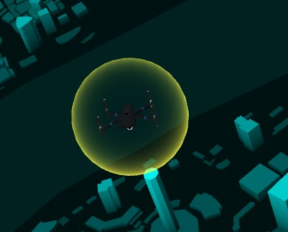

<Boxx/>

<!-- more -->

[[toc]]

## 发光小球
```javascript
var geometry = new THREE.SphereGeometry(25, 30,30);
var material = new THREE.ShaderMaterial({
  vertexShader:   vertexShader,
  fragmentShader: fragmentShader,
  transparent: true
})

var mesh = new THREE.Mesh(geometry, material); //网格模型对象Mesh
model.add(mesh); //网格模型添加到model中


// 波动动画
var S = 2; //波动范围设置
var _s = 1.0;

function waveAnimation() {
  _s += 0.015;
  mesh.scale.set(_s, _s, _s);
  if (_s > S) _s = 1.0;
  requestAnimationFrame(waveAnimation);
}
waveAnimation();

// vertexShader,
export default /* glsl */`
varying vec3 vNormal;
void main() 
{
  // normal：对应geometry.attributes.normal数据
  // 相机视图矩阵和模型自身的矩阵变换都会影响模型表面某位置法线相对视线夹角发生改变
  // 法线矩阵normalMatrix是通过模型的模型矩阵和视图矩阵变换而来
  // three.js内部normalMatrix表示顶点法线的变换矩阵
  vNormal = normalize( normalMatrix * normal ); 
  gl_Position = projectionMatrix * modelViewMatrix * vec4( position, 1.0 );
}
`;

// fragmentShader,
export default /* glsl */ `
varying vec3 vNormal;
void main() 
{
  // 
  vec3 z = vec3(0.0,0.0,1.0);//z轴方向单位向量
  //两个向量夹角余弦值dot(vNormal, z)范围[-1,1]
  float x = abs(dot(vNormal, z));//点乘结果余弦值绝对值范围[0,1]
  //透明度渐变模拟一种透明发光的感觉
  // 夹角零度 余弦值1  夹角90度余弦值0   
  // 对于球体而言：夹角90度的边缘部分最亮或说不透明 中间完全透明
  //float alpha = 1.0-x;//透明度随着余弦值线性变化
    float alpha = pow( 1.0 - x, 3.0 );//透明度随着余弦值非线性变化  比如二次方  三次方 渲染不同的效果
    gl_FragColor = vec4( vec3(0.0,1.0,1.0), alpha );
}
`;

```
## 半球
```javascript
// 创建一个半球
var geometry = new THREE.SphereGeometry(25, 30,30,0,Math.PI*2,0,Math.PI/2);


var material = new THREE.ShaderMaterial({
  vertexShader:   vertexShader,
  fragmentShader: fragmentShader,
  transparent: true
})

var mesh = new THREE.Mesh(geometry, material); //网格模型对象Mesh
model.add(mesh); //网格模型添加到model中


// 波动动画
var S = 2; //波动范围设置
var _s = 1.0;

function waveAnimation() {
  _s += 0.02;
  mesh.scale.set(_s, _s, _s);
  if (_s > S) _s = 1.0;
  requestAnimationFrame(waveAnimation);
}
waveAnimation();

//light_fragment.glsl
export default /* glsl */ `
varying vec3 vNormal;
void main() 
{
  vec3 z = vec3(0.0,0.0,1.0);//z轴方向单位向量
  //两个向量夹角余弦值dot(vNormal, z)范围[-1,1]
  float x = abs(dot(vNormal, z));//点乘结果余弦值绝对值范围[0,1]
  //透明度渐变模拟一种透明发光的感觉
  // 夹角零度 余弦值1  夹角90度余弦值0   
  // 对于球体而言：夹角90度的边缘部分最亮或说不透明 中间完全透明
  //float alpha = 1.0-x;//透明度随着余弦值线性变化
  float alpha = pow( 1.0 - x, 2.0 );//透明度随着余弦值非线性变化  比如二次方  三次方 渲染不同的效果
  gl_FragColor = vec4( vec3(0.0,1.0,1.0), alpha );
}
`;
//light_vertex.glsl
export default /* glsl */`
varying vec3 vNormal;
void main() 
{
  // normal：对应geometry.attributes.normal数据
  // 相机视图矩阵和模型自身的矩阵变换都会影响模型表面某位置法线相对视线夹角发生改变
  // 法线矩阵normalMatrix是通过模型的模型矩阵和视图矩阵变换而来
  // three.js内部normalMatrix表示顶点法线的变换矩阵
  vNormal = normalize( normalMatrix * normal ); 
  gl_Position = projectionMatrix * modelViewMatrix * vec4( position, 1.0 );
}
`;

```


