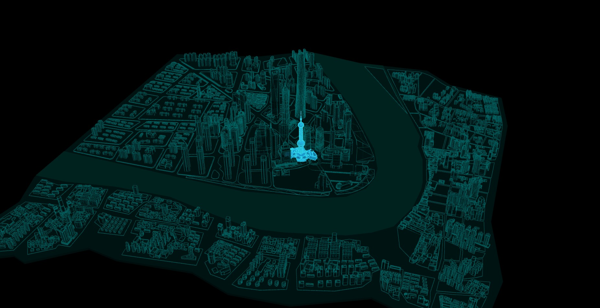
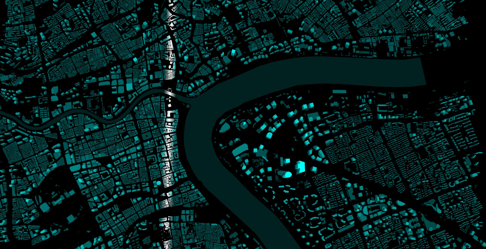
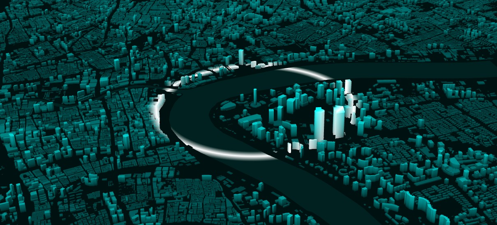

<Boxx/>

<!-- more -->

[[toc]]

## 建筑随着高度透明
```javascript
material.onBeforeCompile = function (shader) {
  // 浏览器控制台打印着色器代码
  // console.log('shader.fragmentShader', shader.fragmentShader)
  // 顶点位置坐标position类似uv坐标进行插值计算，用于在片元着色器中控制片元像素
  shader.vertexShader = shader.vertexShader.replace(
    'void main() {',
    ['varying vec3 vPosition;',
      'void main() {',
      'vPosition = position;',
    ].join('\n') // .join()把数组元素合成字符串
  );
  shader.fragmentShader = shader.fragmentShader.replace(
    'void main() {',
    ['varying vec3 vPosition;',
      'void main() {',
    ].join('\n')
  );
  shader.fragmentShader = shader.fragmentShader.replace('#include <output_fragment>', output_fragment);
};

//output_fragment.glsl
export default /* glsl */`
#ifdef OPAQUE
diffuseColor.a = 1.0;
#endif

// https://github.com/mrdoob/three.js/pull/22425
#ifdef USE_TRANSMISSION
diffuseColor.a *= transmissionAlpha + 0.1;
#endif

// 楼高范围[0,354]
// 线性渐变
// vec3 gradient = mix(vec3(0.0,0.1,0.1), vec3(0.0,1.0,1.0), vPosition.z/354.0);

// 非线性渐变  小部分楼层太高，不同高度矮楼层颜色对比不明显,可以采用非线性渐变方式调节,插值函数
vec3 gradient = mix(vec3(0.0,0.1,0.1), vec3(0.0,1.0,1.0), sqrt(vPosition.z/354.0));

// 在光照影响明暗的基础上，设置渐变   (避免模型材质color属性影响渐变色，设置为默认的纯白色即可)
outgoingLight = outgoingLight*gradient;
gl_FragColor = vec4( outgoingLight, diffuseColor.a );

// 不考虑漫反射材质光照计算的影响 不同面没有明暗变化  没有棱角感
// gl_FragColor = vec4( gradient, 1.0);
`;

```
## 雾
最好把最景色设置为和雾一样的颜色
```javascript
scene.fog = new THREE.Fog(0xcccccc, 10, 12000);
```
## 点阵(模拟地面)
```javascript
var GroundGrid = CreateGroundGrid(100, 80, 0x004444, 0.05, 0x00aaaa)
GroundGrid.position.z = -0.1;

// 封装一个函数，几何相关参数尽量参数化，方便快速调整尺寸改变渲染效果
// rangeSize：地面网格尺寸
// divisions:地面网格细分数
// color：网格线颜色
// R:圆点半径
// RColor：原点颜色
function CreateGroundGrid(rangeSize, divisions, color, R, RColor) {
  var group = new THREE.Group();
  var gridHelper = new THREE.GridHelper(rangeSize, divisions, color, color);
  group.add(gridHelper);
  // console.log('gridHelper',gridHelper)
  gridHelper.material.depthWrite = false;
  gridHelper.renderOrder = -2;
  // CircleGeometry圆形平面几何体
  var geometry = new THREE.CircleGeometry(R, 20, 20);
  geometry.rotateX(Math.PI / 2); //从XOY平面旋转到XOZ平面
  // 可以选择基础网格材质，基础网格材质不受光照影响，和其它场景配合，颜色更稳定，而且节约渲染资源
  var material = new THREE.MeshBasicMaterial({
    color: RColor,
    side: THREE.DoubleSide,
    depthWrite: false,
  });
  // 共享材质和几何体数据，批量创建圆点mesh
  var 间距 = rangeSize / divisions
  var 范围一半 = rangeSize / 2
  for (let i = 0; i < divisions; i++) {
    for (let j = 0; j < divisions; j++) {
      var mesh = new THREE.Mesh(geometry, material);
      mesh.renderOrder = -1;
      mesh.translateX(-范围一半 + i * 间距);
      mesh.translateZ(-范围一半 + j * 间距);
      group.add(mesh)
    }
  }
  return group
}
```
##  模型线框
```javascript
import {
  GLTFLoader
} from '../../../../three.js-r133/examples/jsm/loaders/GLTFLoader.js';
var model = new THREE.Group(); //声明一个组对象，用来添加城市三场场景的模型对象

var loader = new GLTFLoader(); //创建一个GLTF加载器
loader.load("./scene/上海外滩.glb", function (gltf) { //gltf加载成功后返回一个对象
  console.log('控制台查看gltf对象结构', gltf);
  // 设置地面材质
  var Floor = gltf.scene.getObjectByName('地面');
  Floor.material = new THREE.MeshLambertMaterial({
    color: 0x001111,
  });
  // 设置河面材质
  var River = gltf.scene.getObjectByName('河面');
  River.material = new THREE.MeshLambertMaterial({
    color: 0x001f1c,
  });
  // 所有建筑物递归遍历批量设置材质
  gltf.scene.getObjectByName('楼房').traverse(function (child) {
    if (child.isMesh) {
      child.material = new THREE.MeshLambertMaterial({
        // color: 0x1A92C6,//场景小对应颜色  可以亮一些
        color: 0x001111, //场景大可以暗一些  要不然整个屏幕太亮
        transparent: true, //允许透明计算
        opacity: 0.7, //半透明设置
      });
      // 设置模型边线
      var edges = new THREE.EdgesGeometry(child.geometry, 1);
      var edgesMaterial = new THREE.LineBasicMaterial({
        // color: 0x31DEEF,
        color: 0x006666,
      });
      var line = new THREE.LineSegments(edges, edgesMaterial);
      child.add(line);
    }
  });


  // 单独设置东方明珠材质
  var dongfang = gltf.scene.getObjectByName('东方明珠');
  dongfang.material = new THREE.MeshLambertMaterial({
    color: 0x1A92C6, //需要突出的模型可以更加亮一些
    // color: 0x001111,//场景大可以暗一些  要不然整个屏幕太亮
    transparent: true, //允许透明计算
    opacity: 0.7, //半透明设置
  });
  // 设置模型边线
  var edges = new THREE.EdgesGeometry(dongfang.geometry, 1);
  var edgesMaterial = new THREE.LineBasicMaterial({
    color: 0x31DEEF,
    // color: 0x006666,
  });
  var line = new THREE.LineSegments(edges, edgesMaterial);
  dongfang.add(line);


  //把gltf.scene中的所有模型添加到model组对象中
  model.add(gltf.scene);
})
```

## 扫光(光带)
```javascript
import output_fragment from './output_fragment.glsl.js'
// MeshBasicMaterial:不受光照影响
// MeshLambertMaterial：几何体表面和光线角度不同，明暗不同
var material = new THREE.MeshLambertMaterial({
  color: 0x003333, //颜色
});
// GPU执行material对应的着色器代码前，通过.onBeforeCompile()插入新的代码，修改已有的代码
var materialShader = null;
material.onBeforeCompile = function (shader) {
  // 浏览器控制台打印着色器代码
  // console.log('shader.fragmentShader', shader.fragmentShader)
  materialShader = shader;
  shader.uniforms.time = {
    value: 0.0,
  };
  // 顶点位置坐标position类似uv坐标进行插值计算，用于在片元着色器中控制片元像素
  shader.vertexShader = shader.vertexShader.replace(
    'void main() {',
    ['varying vec3 vPosition;',
      'void main() {',
      'vPosition = position;',
    ].join('\n') // .join()把数组元素合成字符串
  );

  shader.fragmentShader = shader.fragmentShader.replace(
    'void main() {',
    ['varying vec3 vPosition;',
      'uniform float time;',
      'void main() {',
    ].join('\n')
  );

  shader.fragmentShader = shader.fragmentShader.replace('#include <output_fragment>', output_fragment);
};

// 创建一个时钟对象Clock
var clock = new THREE.Clock();

function scanAnimation() {
  // 获得两次scanAnimation执行的时间间隔deltaTime
  var deltaTime = clock.getDelta();
  // console.log(deltaTime)
  // 更新uniforms中时间，这样就可以更新着色器中time变量的值
  if (materialShader) {
    materialShader.uniforms.time.value += deltaTime;
    if(materialShader.uniforms.time.value>6)materialShader.uniforms.time.value = 0;
  }

  requestAnimationFrame(scanAnimation);
}
scanAnimation();
//output_fragment.glsl
export default /* glsl */ `
#ifdef OPAQUE
diffuseColor.a = 1.0;
#endif

// https://github.com/mrdoob/three.js/pull/22425
#ifdef USE_TRANSMISSION
diffuseColor.a *= transmissionAlpha + 0.1;
#endif


float x0 = 13520747.0+time*1200.0;
float w = 100.0;//光带宽度一半，单位米

if(vPosition.x>x0&&vPosition.x<x0+2.0*w){
    // 渐变色光带
    float per = 0.0;
    if(vPosition.x<x0+w){
        per = (vPosition.x-x0)/w;
        outgoingLight = mix( outgoingLight, vec3(1.0,1.0,1.0),per);
    }else{
        per = (vPosition.x-x0-w)/w;
        outgoingLight = mix( vec3(1.0,1.0,1.0),outgoingLight,per);
    }
}
gl_FragColor = vec4( outgoingLight, diffuseColor.a );
`;


//渐变光带
export default /* glsl */ `
#ifdef OPAQUE
diffuseColor.a = 1.0;
#endif

// https://github.com/mrdoob/three.js/pull/22425
#ifdef USE_TRANSMISSION
diffuseColor.a *= transmissionAlpha + 0.1;
#endif
// 楼高范围[0,354]
// 线性渐变
// vec3 gradient = mix(vec3(0.0,0.1,0.1), vec3(0.0,1.0,1.0), vPosition.z/354.0);
// 非线性渐变  小部分楼层太高，不同高度矮楼层颜色对比不明显,可以采用非线性渐变方式调节
vec3 gradient = mix(vec3(0.0,0.1,0.1), vec3(0.0,1.0,1.0), sqrt(vPosition.z/354.0));

// 在光照影响明暗的基础上，设置渐变
outgoingLight = outgoingLight*gradient;


float x0 = 13520747.0+time*1200.0;
float w = 100.0;//光带宽度一半，单位米

if(vPosition.x>x0&&vPosition.x<x0+2.0*w){
    // 渐变色光带
    float per = 0.0;
    if(vPosition.x<x0+w){
        per = (vPosition.x-x0)/w;
        outgoingLight = mix( outgoingLight, vec3(1.0,1.0,1.0),per);
    }else{
        per = (vPosition.x-x0-w)/w;
        outgoingLight = mix( vec3(1.0,1.0,1.0),outgoingLight,per);
    }
}
gl_FragColor = vec4( outgoingLight, diffuseColor.a );

`;


//渐变雾化:
//加上雾就行了

```

## 扫光(光环)
```javascript
import output_fragment from './output_fragment.glsl.js'
// MeshBasicMaterial:不受光照影响
// MeshLambertMaterial：几何体表面和光线角度不同，明暗不同
var material = new THREE.MeshLambertMaterial({
  color: 0x00ffff, //颜色
});
// GPU执行material对应的着色器代码前，通过.onBeforeCompile()插入新的代码，修改已有的代码
var materialShader = null;
material.onBeforeCompile = function (shader) {
  // 浏览器控制台打印着色器代码
  // console.log('shader.fragmentShader', shader.fragmentShader)
  materialShader = shader;
  shader.uniforms.time = {
    value: 0.0,
  };
  // 顶点位置坐标position类似uv坐标进行插值计算，用于在片元着色器中控制片元像素
  shader.vertexShader = shader.vertexShader.replace(
    'void main() {',
    ['varying vec3 vPosition;',
      'void main() {',
      'vPosition = position;',
    ].join('\n') // .join()把数组元素合成字符串
  );

  shader.fragmentShader = shader.fragmentShader.replace(
    'void main() {',
    ['varying vec3 vPosition;',
      'uniform float time;',
      'void main() {',
    ].join('\n')
  );

  shader.fragmentShader = shader.fragmentShader.replace('#include <output_fragment>', output_fragment);
};

//glsl
export default /* glsl */ `
#ifdef OPAQUE
diffuseColor.a = 1.0;
#endif

// https://github.com/mrdoob/three.js/pull/22425
#ifdef USE_TRANSMISSION
diffuseColor.a *= transmissionAlpha + 0.1;
#endif
// 楼高范围[0,354]
// 线性渐变
// vec3 gradient = mix(vec3(0.0,0.1,0.1), vec3(0.0,1.0,1.0), vPosition.z/354.0);
// 非线性渐变  小部分楼层太高，不同高度矮楼层颜色对比不明显,可以采用非线性渐变方式调节
vec3 gradient = mix(vec3(0.0,0.1,0.1), vec3(0.0,1.0,1.0), sqrt(vPosition.z/354.0));

// 在光照影响明暗的基础上，设置渐变
outgoingLight = outgoingLight*gradient;


float r0 = 10.0+time*1200.0;
float w = 100.0;//光环宽度一半，单位米
vec2 center = vec2(13524782.0,3664189.75);//几何中心坐标坐标
float L = distance(vPosition.xy,center);//距离圆心距离center
if(L > r0 && L < r0+2.0*w){
    // 渐变色光带
    float per = 0.0;
    if(L<r0+w){
        per = (L-r0)/w;
        outgoingLight = mix( outgoingLight, vec3(1.0,1.0,1.0),per);
    }else{
        per = (L-r0-w)/w;
        outgoingLight = mix( vec3(1.0,1.0,1.0),outgoingLight,per);
    }
}
gl_FragColor = vec4( outgoingLight, diffuseColor.a );

`;
```
