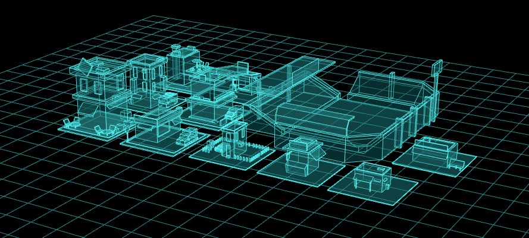

<Boxx/>

<!-- more -->

[[toc]]

##  旋转成型
曲线旋转成面
```javascript
// 通过三个点定义一个二维样条曲线
const curve = new THREE.SplineCurve([
    new THREE.Vector2(50, 60),
    new THREE.Vector2(25, 0),
    new THREE.Vector2(50, -60)
]);
//曲线上获取点,作为旋转几何体的旋转轮廓
const pointsArr = curve.getPoints(50); 
// console.log('旋转轮廓数据',pointsArr);
// LatheGeometry：pointsArr轮廓绕y轴旋转生成几何体曲面
const geometry = new THREE.LatheGeometry(pointsArr, 30);

const material = new THREE.MeshLambertMaterial({
    color: 0x00ffff,
    side: THREE.DoubleSide //两面可见
});
const mesh = new THREE.Mesh(geometry, material);
```
##  12.拉伸ExtrudeGeometry
平面拉伸成体,可以倒角

```javascript
// Shape表示一个平面多边形轮廓
const shape = new THREE.Shape([
    // 按照特定顺序，依次书写多边形顶点坐标
    new THREE.Vector2(-50, -50), //多边形起点
    new THREE.Vector2(-50, 50),
    new THREE.Vector2(50, 50),
    new THREE.Vector2(50, -50),
]);

//拉伸造型
const geometry = new THREE.ExtrudeGeometry(
    shape, //二维轮廓
    {
        depth: 20, //拉伸长度
        bevelThickness: 5, //倒角尺寸:拉伸方向
        bevelSize: 5, //倒角尺寸:垂直拉伸方向
        bevelSegments: 20, //倒圆角：倒角细分精度，默认3
        bevelSegments: 1, //倒直角
        bevelEnabled: true, //禁止倒角,默认true,这里true是允许倒角
    }
);

const material = new THREE.MeshLambertMaterial({
    color: 0x00ffff,
    // wireframe:true,
});
const mesh = new THREE.Mesh(geometry, material)
```
## 13.扫描ExtrudeGeometry
平面随着路径拉伸
```javascript
// 1.扫描轮廓：Shape表示一个平面多边形轮廓
const shape = new THREE.Shape([
    // 按照特定顺序，依次书写多边形顶点坐标
    new THREE.Vector2(10,0), //多边形起点
    new THREE.Vector2(0,10),
    new THREE.Vector2(-10,0)

]);

// 2.扫描轨迹：创建轮廓的扫描轨迹(3D样条曲线)
const curve = new THREE.CatmullRomCurve3([
    new THREE.Vector3( -10, -50, -50 ),
    new THREE.Vector3( 10, 0, 0 ),
    new THREE.Vector3( 8, 50, 50 ),
    new THREE.Vector3( -5, 0, 100)
]);

//3.扫描造型：扫描默认没有倒角
const geometry = new THREE.ExtrudeGeometry(
    shape, //扫描轮廓
    {
        extrudePath:curve,//扫描轨迹
        steps:100//沿着路径细分精度，越大越光滑
    }
);

const material = new THREE.MeshLambertMaterial({
    color: 0x00ffff,
    // wireframe:true,
});
const mesh = new THREE.Mesh(geometry, material);
```
##  绘制平面
通过一个点的移动来形成一个平面,再拉伸
```javascript
const shape = new THREE.Shape();
// console.log('currentPoint',shape.currentPoint);
shape.moveTo(10, 0); //.currentPoint变为(10,0)
// 绘制直线线段，起点(10,0)，结束点(100,0)
shape.lineTo(100, 0);//.currentPoint变为(100, 0)
shape.lineTo(100, 100);//.currentPoint变为(100, 100)
shape.lineTo(10, 100);//.currentPoint变为(10, 100)

// ShapeGeometry填充Shape获得一个平面几何体
// const geometry = new THREE.ShapeGeometry(shape);
// ExtrudeGeometry拉伸Shape获得一个长方体几何体
const geometry = new THREE.ExtrudeGeometry(shape, {
    depth:20,//拉伸长度
    bevelEnabled:false,//禁止倒角
});
const material = new THREE.MeshLambertMaterial({
    color: 0x00ffff,
    // wireframe:true
});
const mesh = new THREE.Mesh(geometry, material);


//怎么移动点形成圆弧

// 下面代码绘制了一个矩形+扇形的轮廓，圆心在(100, 0),半径50。
const shape = new THREE.Shape();
shape.lineTo(100, 0); //.currentPoint变为(100,0)
// 圆弧.arc参数的圆心0,0坐标是相对当前.currentPoint而言，而不是坐标原点
shape.arc(0,0,50,-Math.PI/2,Math.PI/2); //.currentPoint变为圆弧线结束点坐标
console.log('currentPoint',shape.currentPoint);
// 绘制直线，直线起点：圆弧绘制结束的点  直线结束点：(0, 0)
shape.lineTo(-100, 50);
shape.lineTo(-100, 0);
shape.arc(0,0,50,Math.PI/2,Math.PI*2*3/4);
shape.lineTo(100, -50);
shape.lineTo(100, 0);
// shape:填充轮廓  shape有直线之外的曲线，如果默认渲染不光滑，可以设置参数2提升
```
## 多边形打孔

```javascript
// Shape外轮廓：矩形
const shape = new THREE.Shape();
// 绘制直线线段，线段起点：.currentPoint，线段结束点：(100,0)
shape.arc(0,0,50,0,Math.PI*2)
// shape.lineTo(100, 0);//.currentPoint变为(100, 0)
// shape.lineTo(100, 100);//.currentPoint变为(100, 100)
// shape.lineTo(0, 100);//.currentPoint变为(0, 100)

//Shape内孔轮廓
const path1 = new THREE.Path();// 圆孔1
path1.absarc(25, 25, 10);
const path2 = new THREE.Path();// 圆孔2
path2.absarc(-25, 25, 10);
const path3 = new THREE.Path();// 方形孔
path3.absarc(0, 0, 5);
const path4 = new THREE.Path();
path4.moveTo(14,-18)
path4.lineTo(-14,-18)
path4.lineTo(-14,-32)
path4.lineTo(14,-32)

// path3.lineTo(80, 80);
// path3.lineTo(50, 80);
//三个内孔轮廓分别插入到holes属性中
shape.holes.push(path1, path2,path3,path4);


// const geometry = new THREE.ShapeGeometry(shape);

const geometry = new THREE.ExtrudeGeometry(shape, {
    depth:20,//拉伸长度
    bevelEnabled:false,//禁止倒角
    curveSegments:50,
});
const material = new THREE.MeshLambertMaterial({
    color: 0x00ffff,
});
const mesh = new THREE.Mesh(geometry, material);
```
## 模型边界线EdgesGeometry
- Wireframe:

Wireframe 是一种材质属性，可以直接应用于物体的材质中。
当你为一个物体的材质设置 wireframe 属性为 true 时，整个物体将以线框的形式进行渲染，而不是实心的表面。
这是一种在渲染时控制整个物体显示为线框的简便方法。
- EdgesGeometry:

EdgesGeometry 则是一种几何体的类型，用于创建一个新的几何体，该几何体包含原始几何体的边。
你可以使用这个新的几何体创建线段对象，然后将线段对象添加到场景中，以显示原始几何体的线框。
这种方式更为灵活，因为你可以单独控制线框的样式、颜色等属性。
```javascript

const geometry = new THREE.BoxGeometry(50, 50, 50);
const material = new THREE.MeshLambertMaterial({
    color: 0x004444,
    transparent:true,
    opacity:0.8,
});
const mesh = new THREE.Mesh(geometry, material);


// 长方体作为EdgesGeometry参数创建一个新的几何体
const edges = new THREE.EdgesGeometry(geometry);
const edgesMaterial = new THREE.LineBasicMaterial({
  color: 0x00ffff,
})
const mesh1 = new THREE.LineSegments(edges, edgesMaterial);
// mesh.add(line);


//边框化外部模型

// 引入gltf模型加载库GLTFLoader.js
import {
    GLTFLoader
} from 'three/addons/loaders/GLTFLoader.js';


const loader = new GLTFLoader(); //创建一个GLTF加载器
const model = new THREE.Group();

loader.load("../建筑模型.gltf", function (gltf) {
    // 递归遍历设置每个模型的材质，同时设置每个模型的边线
    gltf.scene.traverse(function (obj) {
        if (obj.isMesh) {
            // 模型材质重新设置
            obj.material = new THREE.MeshLambertMaterial({
                color: 0x004444,
                transparent: true,
                opacity: 0.5,
            });
            // 模型边线设置
            const edges = new THREE.EdgesGeometry(obj.geometry);
            const edgesMaterial = new THREE.LineBasicMaterial({
                color: 0x00ffff,
            })
            const line = new THREE.LineSegments(edges, edgesMaterial);
            obj.add(line);
        }
    });
    model.add(gltf.scene);
})
```




