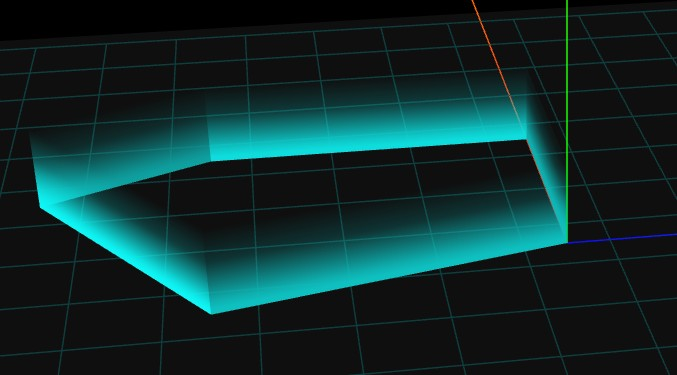

<Boxx/>

<!-- more -->

[[toc]]
## 设置一个地面
```javascript
function plane() {
    var gridHelper = new THREE.GridHelper(300, 15, 0x003333, 0x003333);
    model.add(gridHelper);
    var geometry = new THREE.PlaneGeometry(310, 310); 
    var material = new THREE.MeshLambertMaterial({
        // map: texture,
        color: 0xffffff,
        transparent: true,
        opacity: 0.1,
        side: THREE.DoubleSide,
    });
    var mesh = new THREE.Mesh(geometry, material);
    mesh.position.y = 1
    model.add(mesh);
    mesh.rotateX(-Math.PI / 2);
}
```

## 创建一个墙
```javascript
var c = [
  0, 0, //顶点1坐标
  60, 0, //顶点2坐标
  60, 80, //顶点3坐标
  40, 120, //顶点4坐标
  -20, 80, //顶点5坐标
  0, 0, //顶点6坐标  和顶点1重合
]

var geometry = new THREE.BufferGeometry(); //声明一个空几何体对象
var posArr = [];
var h = 20; //围墙拉伸高度
for (var i = 0; i < c.length - 2; i += 2) {
  // 三角形1  三个顶点坐标
  posArr.push(c[i], c[i + 1], 0, c[i + 2], c[i + 3], 0, c[i + 2], c[i + 3], h);
  // 三角形2  三个顶点坐标
  posArr.push(c[i], c[i + 1], 0, c[i + 2], c[i + 3], h, c[i], c[i + 1], h);
}
// 设置几何体attributes属性的位置position属性
geometry.attributes.position = new THREE.BufferAttribute(new Float32Array(posArr), 3);
geometry.computeVertexNormals();
var material = new THREE.MeshLambertMaterial({
  color: 0xffff00, //三角面颜色
  side: THREE.DoubleSide, //两面可见
  // wireframe:true,//查看三角形结构
});
var mesh = new THREE.Mesh(geometry, material); //网格模型对象Mesh
mesh.rotateX(-Math.PI/2);
model.add(mesh);
```

## 围墙透明度渐变发光shader-自定义高度相关顶点数据
```javascript
var c = [
  0, 0, //顶点1坐标
  60, 0, //顶点2坐标
  60, 80, //顶点3坐标
  40, 120, //顶点4坐标
  -20, 80, //顶点5坐标
  0, 0, //顶点6坐标  和顶点1重合
]

var geometry = new THREE.BufferGeometry(); //声明一个空几何体对象
var posArr = [];
var h = 20; //围墙拉伸高度
for (var i = 0; i < c.length - 2; i += 2) {
  // 三角形1  三个顶点坐标
  posArr.push(c[i], c[i + 1], 0, c[i + 2], c[i + 3], 0, c[i + 2], c[i + 3], h);
  // 三角形2  三个顶点坐标
  posArr.push(c[i], c[i + 1], 0, c[i + 2], c[i + 3], h, c[i], c[i + 1], h);
}
// 设置几何体attributes属性的位置position属性
geometry.attributes.position = new THREE.BufferAttribute(new Float32Array(posArr), 3);
geometry.computeVertexNormals()
var material = new THREE.MeshLambertMaterial({
  color: 0xffff00, //三角面颜色
  side: THREE.DoubleSide, //两面可见
  transparent: true, //需要开启透明度计算，否则着色器透明度设置无效
  opacity: 0.5,//整体改变透明度
  depthTest: false,
});

var posAtt = geometry.attributes.position; //几何体顶点位置缓冲对象
var num = geometry.attributes.position.count;//几何体顶点数量
var alphaArr = []; //每个顶点创建一个透明度数据(随着高度渐变)
for (var i = 0; i < num; i++) {
  // 线性渐变
  alphaArr.push(1 - posAtt.getZ(i) / h);
}
// BufferGeometory自定义一个.attributes.alpha属性,类比.attributes.position
// 几何体的属性.alpha和顶点着色器变量alpha是对应的
geometry.setAttribute('alpha', new THREE.BufferAttribute(new Float32Array(alphaArr), 1));

// GPU执行material对应的着色器代码前，通过.onBeforeCompile()插入新的代码，修改已有的代码
material.onBeforeCompile = function (shader) {
  // console.log('shader.fragmentShader', shader.fragmentShader)
  // 插入代码：在顶点着色器主函数'void main() {'前面插入alpha变量的声明代码
  shader.vertexShader = shader.vertexShader.replace(
    'void main() {',
    `
    attribute float alpha;//透明度分量
      varying float vAlpha;
      void main() {
      vAlpha = alpha; // 顶点透明度进行插值计算
    `
  );
  // 插入代码：片元着色器主函数前面插入`varying float vAlpha;`
  shader.fragmentShader = shader.fragmentShader.replace(
    'void main() {',
    ['varying float vAlpha;',
      'void main() {',
    ].join('\n')
  );
  shader.fragmentShader = shader.fragmentShader.replace('#include <output_fragment>', output_fragment);
};
var mesh = new THREE.Mesh(geometry, material); //网格模型对象Mesh
mesh.rotateX(-Math.PI/2);
model.add(mesh);

//output_fragment.glsl

export default /* glsl */`
#ifdef OPAQUE
diffuseColor.a = 1.0;
#endif

// https://github.com/mrdoob/three.js/pull/22425
#ifdef USE_TRANSMISSION
diffuseColor.a *= transmissionAlpha + 0.1;
#endif

// gl_FragColor = vec4( outgoingLight, diffuseColor.a );
gl_FragColor = vec4( outgoingLight, diffuseColor.a*vAlpha  );
`;

```
## 围墙透明度渐变发光shader - 使用position控制渐变
```javascript
material.onBeforeCompile = function (shader) {
  // 浏览器控制台打印着色器代码
  // console.log('shader.fragmentShader', shader.fragmentShader)
  // 顶点位置坐标position类似uv坐标进行插值计算，用于在片元着色器中控制片元像素
  shader.vertexShader = shader.vertexShader.replace(
    'void main() {',
    ['varying vec3 vPosition;',
      'void main() {',
      'vPosition = position;',
    ].join('\n') // .join()把数组元素合成字符串
  );
  shader.fragmentShader = shader.fragmentShader.replace(
    'void main() {',
    ['varying vec3 vPosition;',
      'void main() {',
    ].join('\n')
  );
  shader.fragmentShader = shader.fragmentShader.replace('#include <output_fragment>', output_fragment);
};
var mesh = new THREE.Mesh(geometry, material); //网格模型对象Mesh
mesh.rotateX(-Math.PI/2);
model.add(mesh);

//output_fragment.glsl
export default /* glsl */`
#ifdef OPAQUE
diffuseColor.a = 1.0;
#endif

// https://github.com/mrdoob/three.js/pull/22425
#ifdef USE_TRANSMISSION
diffuseColor.a *= transmissionAlpha + 0.1;
#endif

//z的坐标区间[0,20] ，围墙高度是20
diffuseColor.a = diffuseColor.a*mix(1.0, 0.0, vPosition.z/20.0);

gl_FragColor = vec4( outgoingLight, diffuseColor.a );
`;

```
##  围墙geometry UV坐标生成(比shader简单点)
```javascript
var c = [
  0, 0, //顶点1坐标
  60, 0, //顶点2坐标
  60, 80, //顶点3坐标
  40, 120, //顶点4坐标
  -20, 80, //顶点5坐标
  0, 0, //顶点6坐标  和顶点1重合
]

var geometry = new THREE.BufferGeometry(); //声明一个空几何体对象
var posArr = [];
var uvrr = [];
var h = 20; //围墙拉伸高度
for (var i = 0; i < c.length - 2; i += 2) {
  // 三角形1  三个顶点坐标
  posArr.push(c[i], c[i + 1], 0, c[i + 2], c[i + 3], 0, c[i + 2], c[i + 3], h);
  // 三角形2  三个顶点坐标
  posArr.push(c[i], c[i + 1], 0, c[i + 2], c[i + 3], h, c[i], c[i + 1], h);

  // 注意顺序问题，和顶点位置坐标对应
  uvrr.push(0, 0, 1, 0, 1, 1);
  uvrr.push(0, 0, 1, 1, 0, 1);
}
var geometry = new THREE.BufferGeometry(); //声明一个空几何体对象
// 设置几何体attributes属性的位置position属性
geometry.attributes.position = new THREE.BufferAttribute(new Float32Array(posArr), 3);
// 设置几何体attributes属性的位置uv属性
geometry.attributes.uv = new THREE.BufferAttribute(new Float32Array(uvrr), 2);
geometry.computeVertexNormals()
var material = new THREE.MeshLambertMaterial({
  color: 0x00ffff, 
  map: new THREE.TextureLoader().load('./scene/渐变.png'),
  side: THREE.DoubleSide, //两面可见
  transparent: true, //需要开启透明度计算，否则着色器透明度设置无效
  // opacity: 0.5,//整体改变透明度
  depthTest: false,
});
var mesh = new THREE.Mesh(geometry, material); //网格模型对象Mesh
mesh.rotateX(-Math.PI / 2);
model.add(mesh);
```

## 流动特效(贴图滚动)
```javascript
var geometry = new THREE.BufferGeometry(); //声明一个空几何体对象
// 设置几何体attributes属性的位置position属性
geometry.attributes.position = new THREE.BufferAttribute(new Float32Array(posArr), 3);
// 设置几何体attributes属性的位置uv属性
geometry.attributes.uv = new THREE.BufferAttribute(new Float32Array(uvrr), 2);
geometry.computeVertexNormals()
var texture = new THREE.TextureLoader().load('./scene/流动.png');
// 设置阵列模式为 RepeatWrapping
texture.wrapS = THREE.RepeatWrapping
texture.wrapT = THREE.RepeatWrapping


function flowAnimation() {
  requestAnimationFrame(flowAnimation);
  // 使用加减法可以设置不同的运动方向
  // 设置纹理偏移
  // y方向流量  光带流动效果
  //texture.offset.y -= 0.06;
   texture.offset.x -= 0.06;
}
flowAnimation();
var material = new THREE.MeshLambertMaterial({
  color: 0x00ffff,
  map: texture,
  side: THREE.DoubleSide, //两面可见
  transparent: true, //需要开启透明度计算，否则着色器透明度设置无效
  // opacity: 0.5,//整体改变透明度
  depthTest: false,
});
var mesh = new THREE.Mesh(geometry, material); //网格模型对象Mesh
mesh.rotateX(-Math.PI / 2);
model.add(mesh);
```
## 流光特效
```javascript
var model = new THREE.Group(); //声明一个组对象，用来添加加载成功的三维场景

var c = [
  0, 0, //顶点1坐标
  60, 0, //顶点2坐标
  60, 80, //顶点3坐标
  40, 120, //顶点4坐标
  -20, 80, //顶点5坐标
  0, 0, //顶点6坐标  和顶点1重合
]
var posArr = [];
var uvrr = [];
var h = 20; //围墙拉伸高度
for (var i = 0; i < c.length - 2; i += 2) {
  // 围墙多边形上两个点构成一个直线扫描出来一个高度为h的矩形
  // 矩形的三角形1
  posArr.push(c[i], c[i + 1], 0, c[i + 2], c[i + 3], 0, c[i + 2], c[i + 3], h);
  // 矩形的三角形2
  posArr.push(c[i], c[i + 1], 0, c[i + 2], c[i + 3], h, c[i], c[i + 1], h);

  // 注意顺序问题，和顶点位置坐标对应
  // uvrr.push(0, 0, 1, 0, 1, 1);
  // uvrr.push(0, 0, 1, 1, 0, 1);
  // 所有点展开  x方向从零到1   所有点生成的矩形铺满一张纹理贴图
  uvrr.push(i / c.length, 0, i / c.length + 2 / c.length, 0, i / c.length + 2 / c.length, 1);
  uvrr.push(i / c.length, 0, i / c.length + 2 / c.length, 1, i / c.length, 1);
}
var geometry = new THREE.BufferGeometry(); //声明一个空几何体对象
// 设置几何体attributes属性的位置position属性
geometry.attributes.position = new THREE.BufferAttribute(new Float32Array(posArr), 3);
// 设置几何体attributes属性的位置uv属性
geometry.attributes.uv = new THREE.BufferAttribute(new Float32Array(uvrr), 2);
geometry.computeVertexNormals()
var texture = new THREE.TextureLoader().load('./scene/流光.png');
// 设置阵列模式为 RepeatWrapping
texture.wrapS = THREE.RepeatWrapping
texture.wrapT = THREE.RepeatWrapping
texture.repeat.x = 3;// x方向阵列
texture.repeat.y = 3;// y方向阵列
function flowAnimation() {
  requestAnimationFrame(flowAnimation);
  // texture.offset.y -= 0.02;
  texture.offset.x -= 0.02;
}
flowAnimation();

var material = new THREE.MeshLambertMaterial({
  color: 0xffff00,
  map: texture,
  side: THREE.DoubleSide, //两面可见
  transparent: true, //需要开启透明度计算，否则着色器透明度设置无效
  depthTest: false,
});
var mesh = new THREE.Mesh(geometry, material); //网格模型对象Mesh
mesh.rotateX(-Math.PI / 2);
model.add(mesh);
```
## 水面纹理(贴图)
```javascript
import {
  lon2xy
} from './math.js';
// 水面颜色贴图
var texture = new THREE.TextureLoader().load('./scene/水面.jpg');
// 水面法线贴图
var normalTexture = new THREE.TextureLoader().load('./scene/normal.jpg');
// 设置阵列模式为 RepeatWrapping
texture.wrapS = THREE.RepeatWrapping
texture.wrapT = THREE.RepeatWrapping
// 水面区域比较大的话，纹理贴图不能无限大，一般可以通过阵列解决。
texture.repeat.set(20, 20); // x和y方向阵列纹理贴图
normalTexture.wrapS = THREE.RepeatWrapping
normalTexture.wrapT = THREE.RepeatWrapping
normalTexture.repeat.set(20, 20);
// 流动动画 最简单方式就是使用texture的offset属性实现  也可以用更麻烦的shader实现
var t = 0;

function flowAnimation() {
  requestAnimationFrame(flowAnimation);
  t += 0.02;
  var y = 0.05 * Math.sin(t);
  texture.offset.x = y;
  texture.offset.y = y;
}
flowAnimation();
// lambert不支持法线 使用高光材质Phong
var material = new THREE.MeshPhongMaterial({
  // color: 0x0099ff,
  map: texture,
  normalMap: normalTexture,
  normalScale: new THREE.Vector2(5, 5)
}); //材质对象


// pointsArrs：多个多边形轮廓
function WaterShapeMesh(pointsArrs) {
  var shapeArr = []; //轮廓形状Shape集合
  pointsArrs.forEach(pointsArr => {
    var vector2Arr = [];
    // 转化为Vector2构成的顶点数组
    pointsArr[0].forEach(elem => {
      var xy = lon2xy(elem[0], elem[1]); //经纬度转墨卡托坐标
      vector2Arr.push(new THREE.Vector2(xy.x, xy.y));
    });
    var shape = new THREE.Shape(vector2Arr);
    shapeArr.push(shape);
  });
  var geometry = new THREE.ShapeGeometry( //填充多边形
    shapeArr,
  );
  // 把UV坐标范围控制在[0,1]范围

  var pos = geometry.attributes.position; //顶点位置坐标
  var uv = geometry.attributes.uv; //顶点UV坐标
  var count = pos.count; //顶点数量
  var xArr = []; //多边形polygon的所有x坐标
  var yArr = []; //多边形polygon的所有y坐标
  for (var i = 0; i < count; i++) {
    xArr.push(pos.getX(i));
    yArr.push(pos.getY(i));
  }
  // minMax()计算polygon所有坐标,返回的极大值、极小值
  var [xMin, xMax] = minMax(xArr);
  var [yMin, yMax] = minMax(yArr);
  var xL = xMax - xMin;
  var yL = yMax - yMin;
  // 根据多边形顶点坐标与最小值差值占最大值百分比，设置UV坐标大小 把UV坐标范围控制在[0,1]范围
  for (var i = 0; i < count; i++) {
    var uvx = (pos.getX(i) - xMin) / xL;
    var uvy = (pos.getY(i) - yMin) / yL;
    uv.setXY(i, uvx, uvy)
  }
  console.log('控制台查看修改后的UV坐标', geometry.attributes.uv.array)

  //   多边形坐标进行排序
  function minMax(arr) {
    // 数组元素排序
    arr.sort(compareNum);
    // 返回极小值和极大值
    return [arr[0], arr[arr.length - 1]]
  }
  // 数组排序规则
  function compareNum(num1, num2) {
    if (num1 < num2) {
      return -1;
    } else if (num1 > num2) {
      return 1;
    } else {
      return 0;
    }
  }


  var mesh = new THREE.Mesh(geometry, material); //网格模型对象
  return mesh;
}
```
