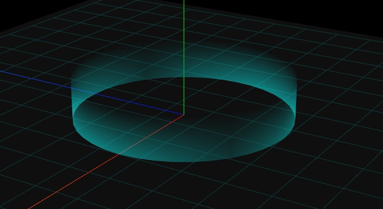

<Boxx/>

<!-- more -->

[[toc]]

## 圆柱体(不含上下表面)
```javascript
var model = new THREE.Group(); //声明一个组对象
/**
 * 创建网格模型
 */
// 圆柱几何体，参数5设置不生成圆柱的两个底面
var geometry = new THREE.CylinderGeometry(50, 50, 20, 40, 16, true);
geometry.translate(0, 10, 0);
var material = new THREE.MeshLambertMaterial({
  color: 0x00ffff, //颜色
  side: THREE.DoubleSide, //两面可见
}); //材质对象Material
var mesh = new THREE.Mesh(geometry, material); //网格模型对象Mesh
model.add(mesh); //网格模型添加到model中
```
## 平行光
```javascript
const directionalLight = new THREE.DirectionalLight(0xffffff, 0.7); // 颜色、强度
directionalLight.position.set(1, 1, 1); // 设置光源方向
scene.add(directionalLight);
```

## 透明度渐变(贴图法)
```javascript
// 引入Three.js
import * as THREE from '../../../../three.js-r133/build/three.module.js';


var model = new THREE.Group(); //声明一个组对象
/**
 * 创建网格模型
 */
// 圆柱几何体，参数5设置不生成圆柱的两个底面
var geometry = new THREE.CylinderGeometry(50, 50, 20, 40, 1, true);
geometry.translate(0, 10, 0);
var material = new THREE.MeshLambertMaterial({
  color: 0x00ffff, //颜色
  map: new THREE.TextureLoader().load('./scene/渐变.png'),
  side:THREE.DoubleSide,//两面可见
  transparent: true, //需要开启透明度计算，否则着色器透明度设置无效
  opacity: 0.5,//整体改变透明度
  depthTest:false,
}); //材质对象Material
var mesh = new THREE.Mesh(geometry, material); //网格模型对象Mesh
model.add(mesh); //网格模型添加到model中


// 波动动画
var S= 3;//波动范围设置
var _s = 1.0;
function waveAnimation() {
  _s += 0.02;
  mesh.scale.set(_s, _s,  _s);
  if (_s > S) _s = 1.0;
  requestAnimationFrame(waveAnimation);
}
waveAnimation();


plane();//设置一个地面
function plane() {
    var gridHelper = new THREE.GridHelper(300, 15, 0x003333, 0x003333);
    model.add(gridHelper);
    var geometry = new THREE.PlaneGeometry(310, 310); 
    var material = new THREE.MeshLambertMaterial({
        // map: texture,
        color: 0xffffff,
        transparent: true,
        opacity: 0.1,
        side: THREE.DoubleSide,
    });
    var mesh = new THREE.Mesh(geometry, material);
    mesh.position.y = 1
    model.add(mesh);
    mesh.rotateX(-Math.PI / 2);
}

export {
  model
}
```


##  透明度渐变(shader)
```javascript
// 引入Three.js
import * as THREE from '../../../../three.js-r133/build/three.module.js';
import output_fragment from './output_fragment.glsl.js'

var model = new THREE.Group(); //声明一个组对象
/**
 * 创建网格模型
 */
// 圆柱几何体，参数5设置不生成圆柱的两个底面
var geometry = new THREE.CylinderGeometry(50, 50, 20, 40, 1, true);
geometry.translate(0, 10, 0);
var material = new THREE.MeshLambertMaterial({
  color: 0x00ffff, //颜色
  side:THREE.DoubleSide,//两面可见
  transparent: true, //需要开启透明度计算，否则着色器透明度设置无效
  opacity: 0.5,//整体改变透明度
  depthTest:false,
}); //材质对象Material

// GPU执行material对应的着色器代码前，通过.onBeforeCompile()插入新的代码，修改已有的代码
material.onBeforeCompile = function (shader) {
  // 浏览器控制台打印着色器代码
  // console.log('shader.fragmentShader', shader.fragmentShader)
  // 顶点位置坐标position类似uv坐标进行插值计算，用于在片元着色器中控制片元像素
  shader.vertexShader = shader.vertexShader.replace(
    'void main() {',
    ['varying vec3 vPosition;',
      'void main() {',
      'vPosition = position;',
    ].join('\n') // .join()把数组元素合成字符串
  );
  shader.fragmentShader = shader.fragmentShader.replace(
    'void main() {',
    ['varying vec3 vPosition;',
      'void main() {',
    ].join('\n')
  );
  shader.fragmentShader = shader.fragmentShader.replace('#include <output_fragment>', output_fragment);
};
var mesh = new THREE.Mesh(geometry, material); //网格模型对象Mesh
model.add(mesh); //网格模型添加到model中


plane(); //设置一个地面
function plane() {
  var gridHelper = new THREE.GridHelper(300, 15, 0x003333, 0x003333);
  model.add(gridHelper);
  var geometry = new THREE.PlaneGeometry(310, 310);
  var material = new THREE.MeshLambertMaterial({
    // map: texture,
    color: 0xffffff,
    transparent: true,
    opacity: 0.1,
    side: THREE.DoubleSide,
  });
  var mesh = new THREE.Mesh(geometry, material);
  mesh.position.y = 1
  model.add(mesh);
  mesh.rotateX(-Math.PI / 2);
}

export {
  model
}


//glsl
export default /* glsl */`
#ifdef OPAQUE
diffuseColor.a = 1.0;
#endif

// https://github.com/mrdoob/three.js/pull/22425
#ifdef USE_TRANSMISSION
diffuseColor.a *= transmissionAlpha + 0.1;
#endif

//y的坐标区间[0,20] ，高度是20
diffuseColor.a = diffuseColor.a*mix(1.0, 0.0, vPosition.y/20.0);

gl_FragColor = vec4( outgoingLight, diffuseColor.a );
`;

```
